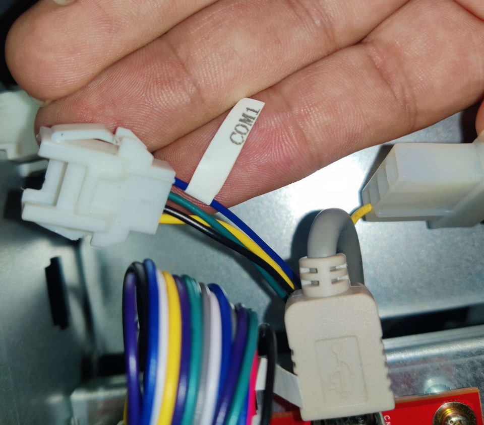
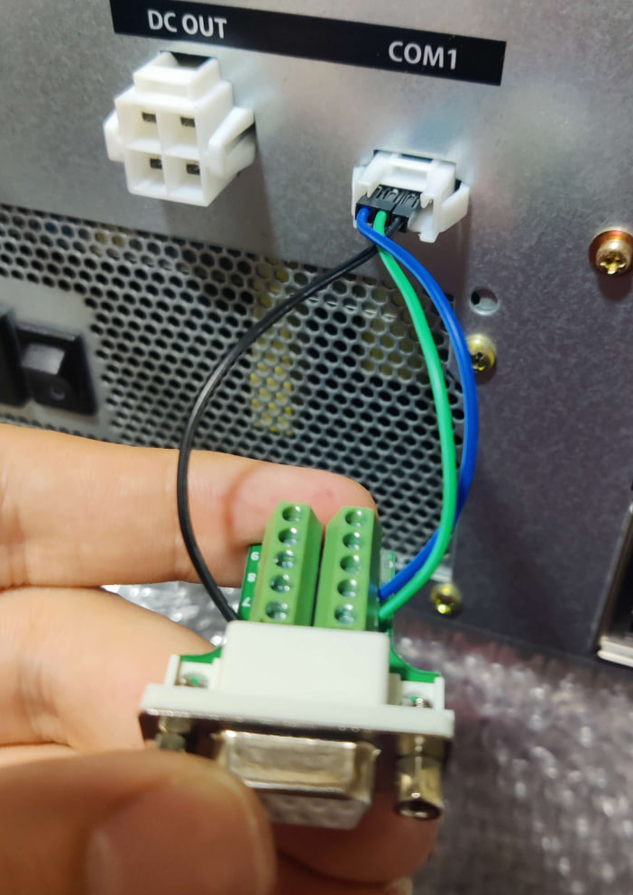
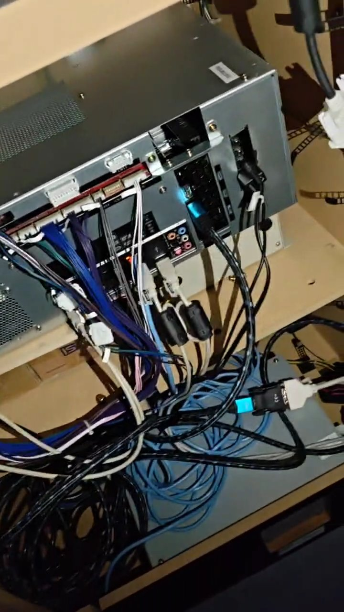

# IIDX Epolis upgrade with CCJ PCB
>[!NOTE] 
> Mirror: https://rentry.co/iidx-epolis-ccj-upgrade

This is a little guide where I've documented the most notable parts of the Epolis upgrade I did for my IIDX cabinet, may anyone find it useful.

Feel free to DM me in Discord if you have questions: @elmiamiman
> [!NOTE] 
> # Further documentation
> You can also follow this guide as it may be more comprehensive: https://docs.google.com/document/d/1i4etnZGyecHbVvoRPkY14CLfO-HF48YDg5liX45Ui2A/edit?tab=t.0#heading=h.m8ozwkt8m7wu
> 
> Big shout out the Rhythm Game Cabs Discord server which is where I've gathered most of this info
> # Regarding cabinet
> This was done on a beatmania IIDX Tricoro cabinet
## Step 1: Swap BIO2

Swap I/O board from CCJ for the BIO2 inside the IIDX PCB (assuming it is a CB PCB)

> [!NOTE] 
> # Regarding I/O board
> CCJ BIO2 has BI2X firmware already flashed, it is not compatible for legacy IIDX, but it could be used for a 120hz upgrade
## Step 2: Take important cables
Unplug **CN15** and **COM** (CN7 in BIO2) cables from IIDX PCB, has to be plugged into the BIO2 inside the CCJ
   - Cables look like this: 
## Step 3: Get the audio card
Buy a Asus XONAR AE audio card and insert it to any PCIe slot, line signal will go into the FRONT jack port from the card.

> [!warning] 
> # Keep in mind
> You will have to cut open a hole on the PCB case at the same spot where your XONAR will be, otherwise you won't be able to plug anything into the card. How you want to cut it is totally up to you depending on what you want or need.
## Step 4: Place CCJ PCB inside the cab

Since the CCJ PCB is pretty large, as it cannot or it is very difficult to put inside the cabinet vertically, what I did is to place it horizontally, using the transformer inside and whatever you can use that is robust enough and the same height as said transformer as support, along with the wooden tray used for the IIDX PCB, which should be attached to it at the beginning (pictures shown at the end). A cleaner (and of course less crazy) solution would be building a tray or some kind of platform so it stays above the transformer.
## Step 5: Readers

For the readers, the most seamless solution is to build a RS232 DB9 male connector to plug the reader serial cable and to plug into the CCJ's COM1 port, which is a JST connector
### Step 5.1: Building the COM1 cable
> [!IMPORTANT]
> # Bill Of Materials
> #### COM:	  
> - JST XMP-04:
>	- Connector: https://a.aliexpress.com/_EJzqbCA
>	- Terminals (SXA-001T-P0.6): https://a.aliexpress.com/_EzkgZqi
> #### Serial
> - Male connector: https://aliexpress.com/item/1005005687483372.html
> #### Wire
> I bought this because it has the colours I wanted to use but use anything that works for you https://aliexpress.com/item/1005008439816483.html

You can do two versions for the same solution:
##### 1. Plugging Dupont cables following the next diagram when connecting:

Following the same color codes, the result should look something like this:

Since this only for serial data transfer, the fourth pin on the COM1 connector in the CCJ, which corresponds to +12V, goes unused, therefore the only pins needed will be, in order, TX, RX and GND.

The resulting pinout would be:

| DB9         | to  | JST         |
| ----------- | --- | ----------- |
| RX (pin 2)  | ->  | TX (pin 2)  |
| TX (pin 3)  | ->  | RX (pin 1)  |
| GND (pin 5) | ->  | GND (pin 3) |

Be sure to keep the metal part of the Dupont side up and try to push it inside as far as you can without too much force. This just works™ but Dupont cables are pretty frail and can unplug at any time if you need to move the cabinet
##### 2. Build a JST connector:
This takes a bit of extra effort but results in a more clean and resilient solution. Only materials needed are the JST plugs and terminals attached at the beginning of the section, and of course a crimper.

# Result inside cab
