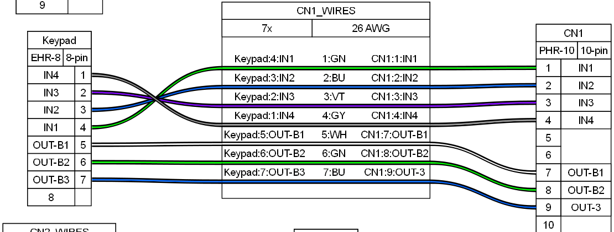

    

# Installing reader in pop'n music Type-A (Animelo) cabinet
This is a small, probably not very well developed guide showing how to set up an original Konami IC reader for a pop'n music Type-A (Animelo) cabinet.

These cabinets may have the reader already set up if they come with the pillar reader, otherwise you can work it this way if you want to install it.

Feel free to DM me in Discord if you have questions: @elmiamiman
## Reader Wiring
> [!important] 
> # Bill Of Materials 
> #### CN2: 
> - PHR-3:
> 	- Harness (male connector):  https://es.aliexpress.com/item/1005008864177105.html
> #### CN3:	  
> - XHP-3:
>	- Harness: https://es.aliexpress.com/item/1005008155715160.html
>	- Cables were wired to a solderless RS232 DB9 connector
> #### Serial
> - RS232 DB9 cable, 2 meters minimum, at least one female end
> - Connector for reader: https://aliexpress.com/item/1005005687483372.html

According to the manual, this is how IC readers are wired:
- CN1: Keypad
- CN2: Power
- CN3: Serial signal

CN3 might just be wired up to a RS232 DB9 connector for ease of use. That same connector will be connected to a DB9 cable that will have to go down the cabinet until the PCB, then connected to the PC's serial connector. A 2 meter cable should be enough length.

CN2 needs to be powered with 12V, in my case there was already a splice made where I could take 12V easily, one may take it from the cabinet's PSU if possible or an external one. Same case for the ground
## Keypad
> [!important]
> # Bill Of Materials 
> #### CN1: 
> - PHR-10:
> 	- Harness: https://es.aliexpress.com/item/1005008339053787.html
> #### Keypad:	  
> - EHR-8:
>	- Harness: https://es.aliexpress.com/item/1005005276963716.html

The cable that comes out from the keypad goes into CN1 in the reader:

> [!tip] 
> # For wiring the keypad
> Keep in mind that the order of pins, from left to right and while the keys are face up, will be in reverse order, that is from 8 to 1, as can be seen in the next picture.
> 
> Be careful with this detail, and also that the IN pins are reversed in the keypad connector, in order to not mix up the wiring and make the keypad send the wrong inputs

## Mounting the reader and keypad
For this cabinet the instruction card was replaced with a 3D printed panel where the both the reader and the keypad have been mounted to make them easily accessible.

The 3D model by @roxandtol on Discord can be found here: https://www.printables.com/model/1509814-popn-animelo-front-panel
# Results

