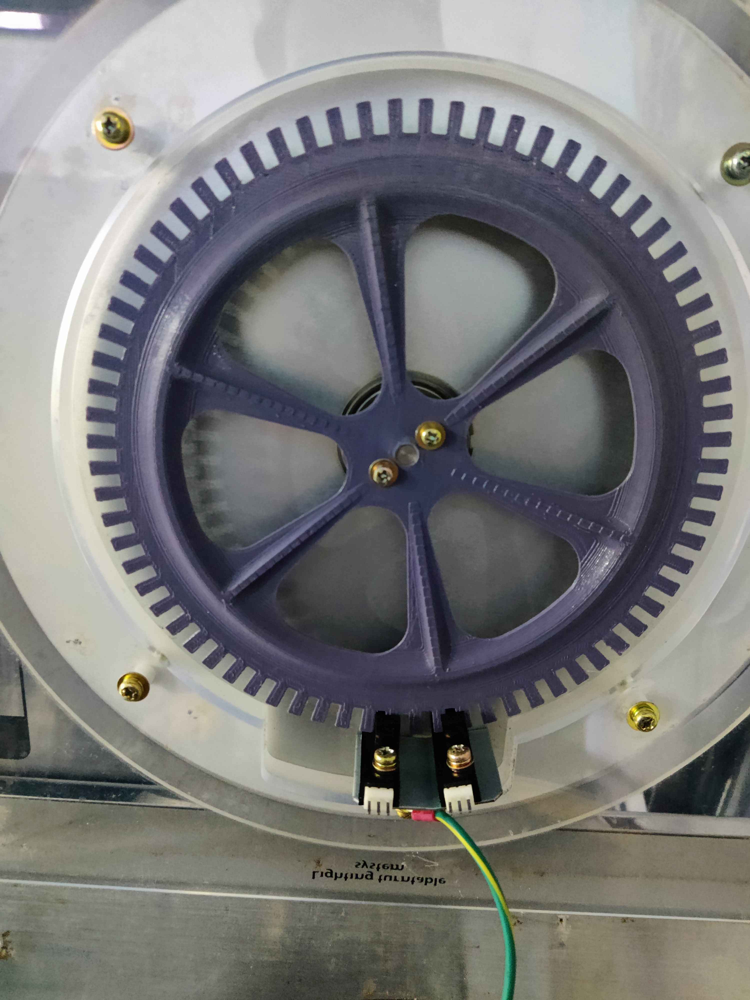
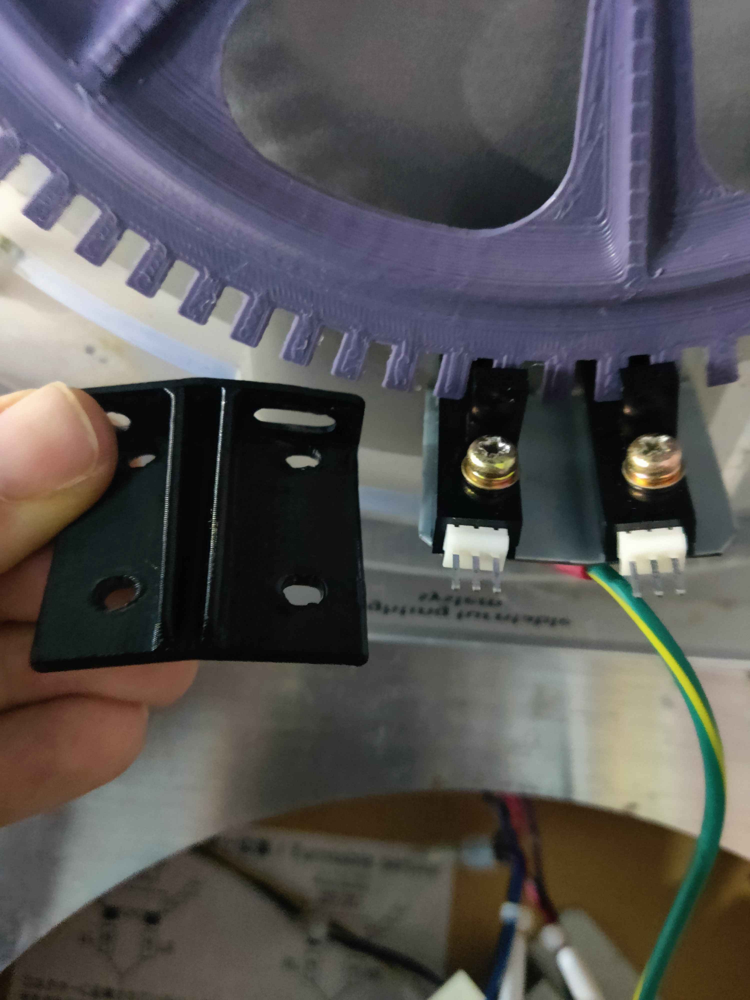
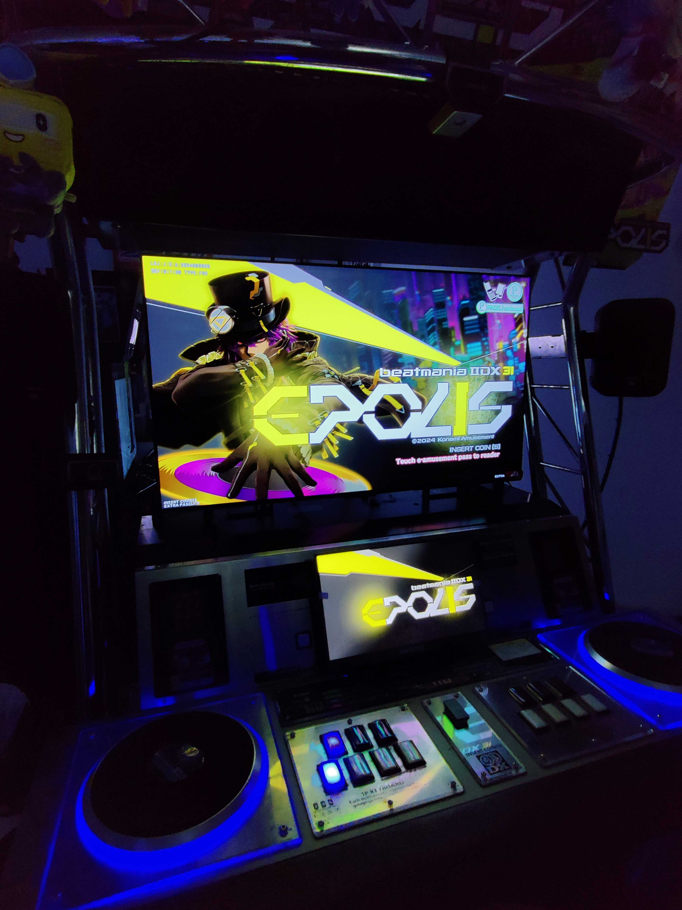
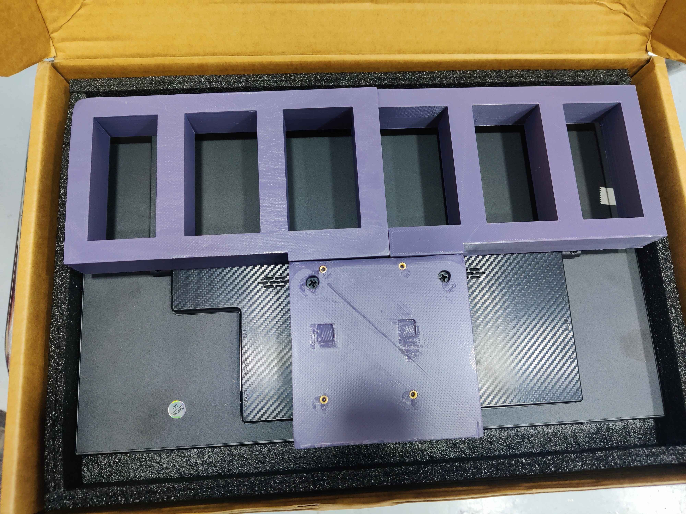
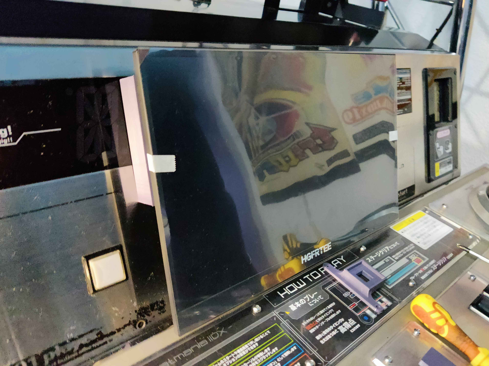
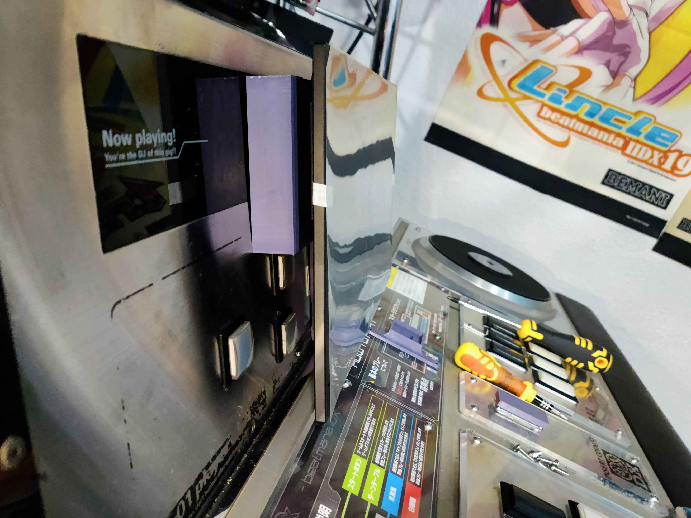
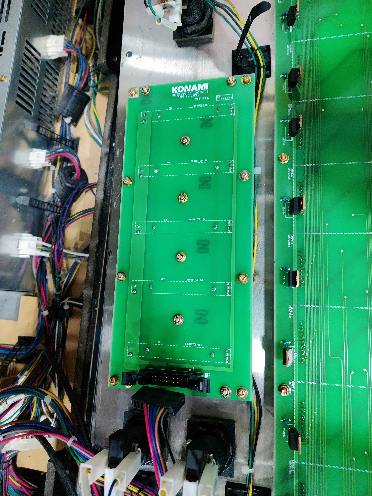
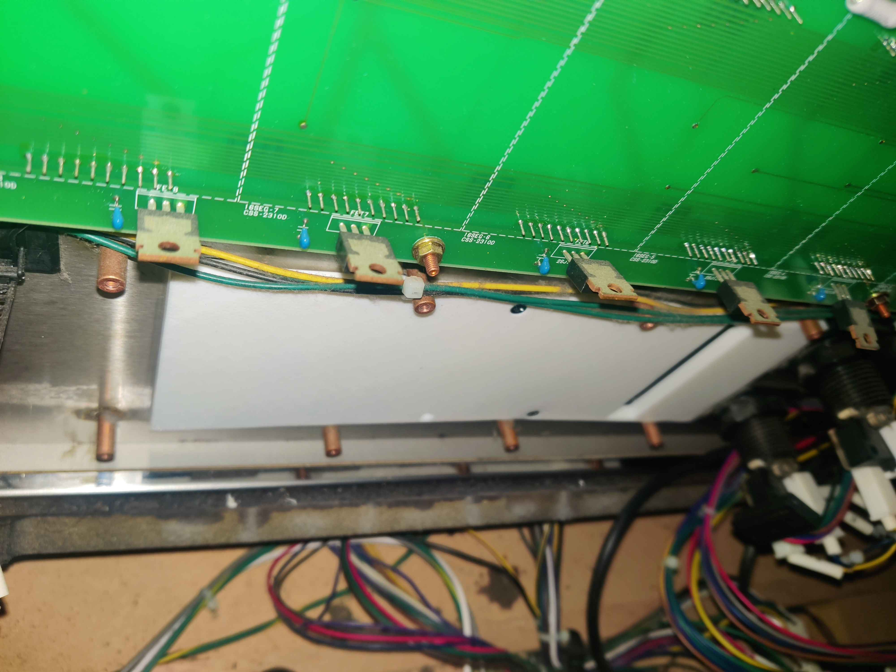

# Lightning Convert with Tricoro Cab
> [!NOTE] Further documentation
> You might want check out KokoseiJ's guide for further documentation and details, especially for older IIDX cabinet versions:
> > [!tip] [IIDX Gender Affirmation Surgery Guide](https://docs.google.com/document/d/e/2PACX-1vSbuydsZMF6iAVXuimRPdbduLPOiN8MXTouWZ5hBh0vGj5idvvYUR7WGNZ7ItnZblYWnQOS1VakZ567/pub "https://docs.google.com/document/d/e/2PACX-1vSbuydsZMF6iAVXuimRPdbduLPOiN8MXTouWZ5hBh0vGj5idvvYUR7WGNZ7ItnZblYWnQOS1VakZ567/pub")
> 
> Big shout out the Rhythm Game Cabs Discord server which is where I've gathered most of this info

> [!info] Regarding cabinet
> This was done on a beatmania IIDX Tricoro cabinet

This will be a continuation from a previous guide where I upgraded a IIDX Tricoro cabinet with a CCJ PCB in order to be able to play versions from RESIDENT and beyond. You may catch up with that guide first[^1]:

Here I've tried to document and cover the upgrade of a IIDX Tricoro cabinet to a 120Hz/LM convert cabinet, with the addition of installing LED lights like in LM cabinets, as well as rewiring the existing leds for the turntables and woofers to light the same way as LM cabinets (RGB light depending on game) and also adding lights for IC readers. All done while keeping the cabinet's furniture completely intact.

Feel free to DM me in Discord if you have questions: @elmiamiman

**Relevant connectors**:
- CN10: Woofer and Reader Lights
- CN15: 1P keys and Audio Jack
- CN18: WS2818b lights
- CN19: TT Lights and Woofer Blue Light
![[bio2/bio2.png]]![[bio2/bio2-2.jpg]]![[bio2/cn15.jpg]]![[bio2/cn10-cn13.jpg]]![[bio2/cn19.jpg]]
![[bio2/ccj-bio2-connectors.png]]![[bio2/bio2-connected-cables.png]]![[bio2/ccj.png]]

----------------
---
# Setting up for TDJ
For a Tricoro cab, luckily most of the hard work is done, so basically what you need is:
> - A screen capable of displaying at least 1080p@120hz
> - A touch screen capable of displaying 720p@60hz
> - BIO2 board with BI2X firmware

Other cabinet models will need ICCC readers (called "blue readers") and a rewiring job for the readers to work. Tricoro cabs already have this set up.

Also you will need to put back the original turntable teeth discs, or at least some discs that have 72 teeth instead of 144, and with it's original mounts if you changed them for the same mod, since BI2X firmware reads half pulse and it results in having the same sensibility as having a 144 teeth disc on LDJ.

Instead of using the original aluminium discs I've used 3D printed discs. Design made by @roxandtol: [https://www.printables.com/model/1525394-iidx-turntable-tooth-wheel](https://www.printables.com/model/1525394-iidx-turntable-tooth-wheel)

> TODO: insert more info for older cabinets
### Screen
In my case I've used a LG C5 42" OLED TV, which is as big as the CANNON BALLERS screen. This TV in specific offers a very low input lag too.
LG OLED TVs, while usually expensive, are highly recommended. Cheaper options can be considered if looking instead for VA panels, like the Gigabyte AORUS FV43U.

Other options to consider for both VA and OLED are also screens from Sony, Samsung, Asus, LG QLED ones, etc.[^2]

A cheaper option available in the US is to get a Vizio Quantun 43" display. In EU maybe some options might be either Hisense or TCL.

If you have an original Tricoro monitor with its mount, I recommend to take the entire mount and disassemble the monitor starting from below the mount. 

Some people instead kept the monitor chassis by replacing only the monitor with an Asus ROG Swift PG38UQ 38" display, so it is an option to consider if you want to keep the original look.

The screen will be connected to the graphic's card DisplayPort. If your screen only has HDMI input, like LG OLED's screens, you might want to get a DP to HDMI converter dongle. I got this one for example: https://amzn.eu/d/0iVZCXwP

### Touch screen
Any touch screen with covers the characteristics above should be enough.
In my case I got this one from Aliexpress, as a cheaper option: https://aliexpress.com/item/1005007445019329.html

Additionaly a mount for the touch screen is ideal to keep it in place. I used the one made for this guide: https://www.printables.com/model/1362898-beatmania-iidx-lightning-model-upgrade-parts/comments

This mount sits over the sliders, hiding them completely, and it's held from behind the front panel, having to remove the sliders PCB previously, although it also stays over the Effect and VEFX buttons. The same guide also provides a printable model for replacing the Insert Coin plate with a piece which holds both buttons.

The subscreen will be connected to the graphic's card first HDMI (labelled HDMI 1) and at least one USB C for touch input into the PCB USBs

 
### BIO2
If you got a CCJ for the upgrade needed to run EPOLIS, then you may have a spare BIO2 with BI2X already flashed, otherwise you may have to flash your BIO2.

How do you know if you have the correct one? On Windows, when connecting the board to a PC, you can check its PID on the Device Manager, if the PID is `8050`, then it's good to go, otherwise if it's `8040`/`804C`, then it still has BI2A firmware.

On first boot you may get a `USB I/O ERROR: EROR BI2A` message, which probably may depend on setup, but for me after a reboot the game loaded just fine.

If you got all of this done and it Works™, congrats, you converted your IIDX to a Lightning Model! You don't really need anything else.

Only drawbacks for this convert is that top speaker lights and volume sliders go unused due to BI2X firmware. If you want the sliders to work then you may look for another solution instead of this, like 🏳️‍⚧️LDJ.

If you want the lights back and also working like in LM, then next up is how I managed to get them done, having working TT lights, woofer lights, reader lights, working audio jacks for headphones and an attempt to replicate the lights that can be controlled from the touch screen. 
# [[audio-jack-guide|🎧 Audio Jack wiring]]
![[audio-jack-guide]]

---
---
# [[rgb-lights-guide|🚥 RGB Lights wiring]]
![[rgb-lights-guide]]

---
---
# [[ws2812b-lights-guide|🚨 WS2812b Lights wiring]]
![[ws2812b-lights-guide]]
# Results

[^1]: [[../iidx-epolis-upgrade|IIDX EPOLIS upgrade with CCJ PCB]] ([Mirror](https://rentry.co/iidx-epolis-ccj-upgrade))
[^2]: Some more models can be found in [iidx.org](https://iidx.org/infinitas_monitor#tvs).

