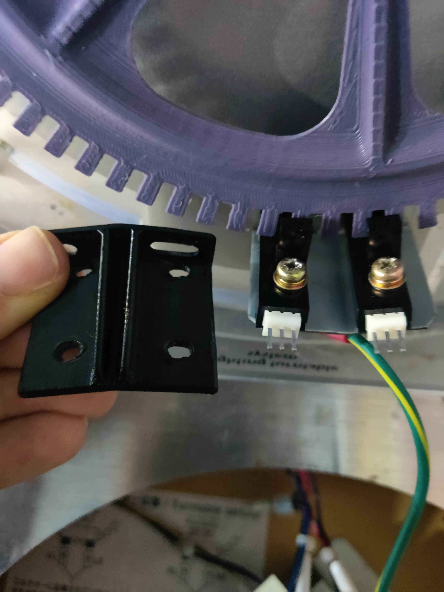
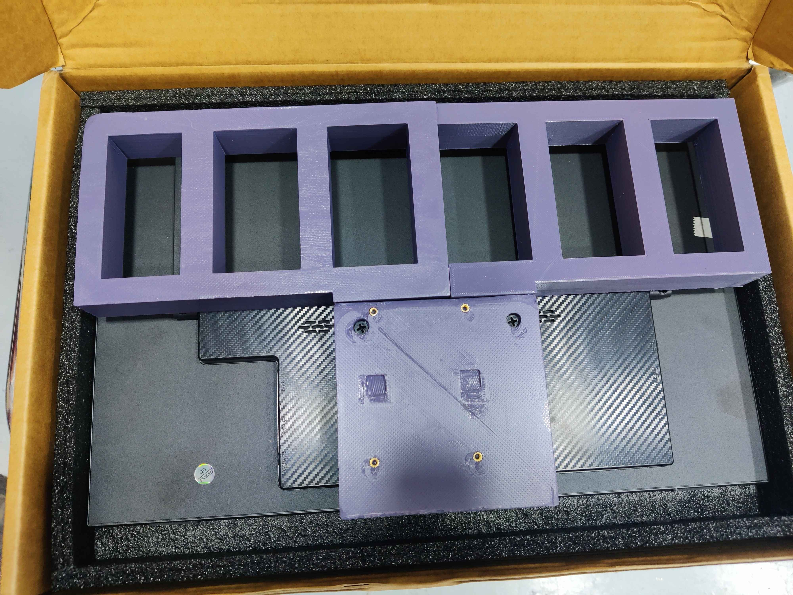
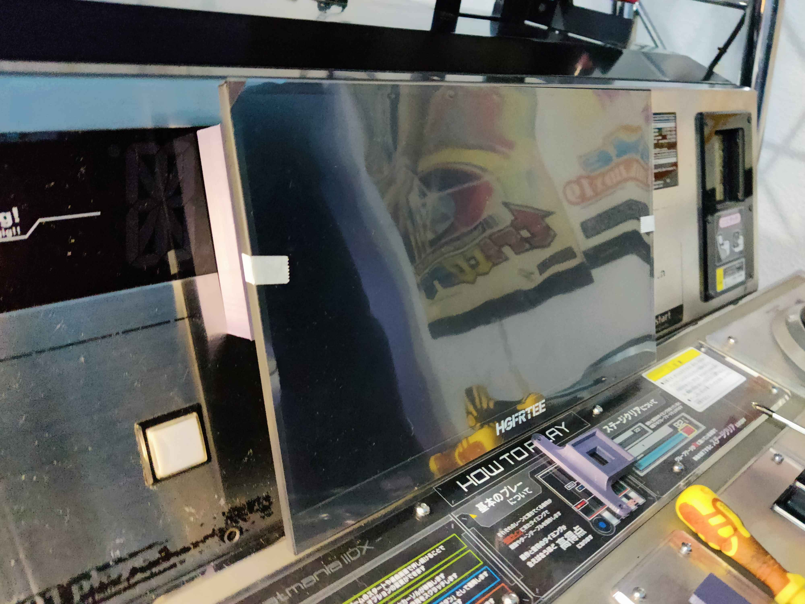
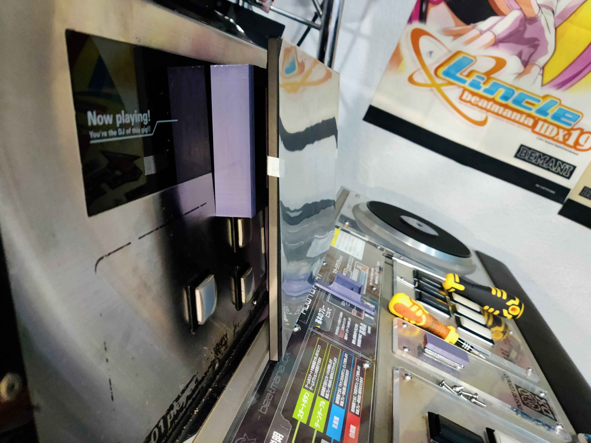
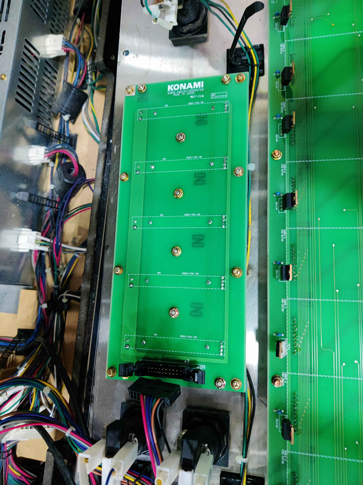
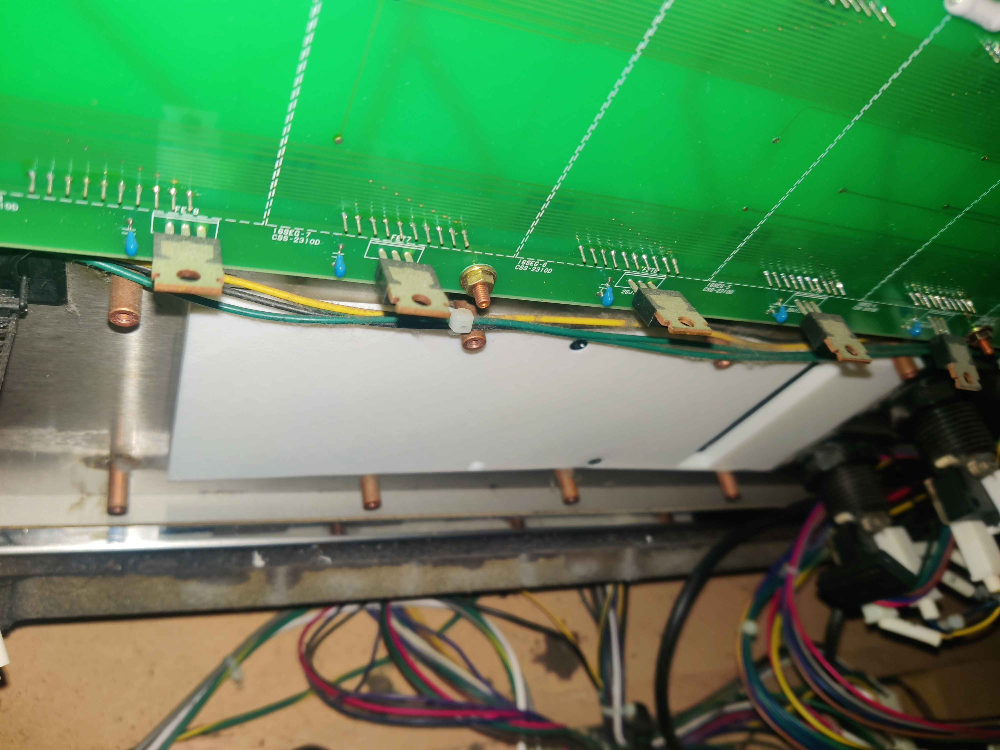

# Lightning Convert with Tricoro Cab
> [!NOTE] Further documentation
> You might want to check out @kokoseij's guide for further documentation and details, especially for older IIDX cabinet versions:
> > [!tip] [IIDX Gender Affirmation Surgery Guide](https://docs.google.com/document/d/e/2PACX-1vSbuydsZMF6iAVXuimRPdbduLPOiN8MXTouWZ5hBh0vGj5idvvYUR7WGNZ7ItnZblYWnQOS1VakZ567/pub "https://docs.google.com/document/d/e/2PACX-1vSbuydsZMF6iAVXuimRPdbduLPOiN8MXTouWZ5hBh0vGj5idvvYUR7WGNZ7ItnZblYWnQOS1VakZ567/pub")
> 
> Big shout out to the Rhythm Game Cabs Discord server which is where I've gathered most of this info.

> [!info] Regarding cabinet
> This was done on a beatmania IIDX Tricoro cabinet.

This section is a continuation from a previous guide where I upgraded a IIDX Tricoro cabinet with a CCJ PCB in order to be able to play versions from RESIDENT and beyond. It is recommended to review that guide first:
#### [[../iidx-epolis-upgrade|IIDX EPOLIS upgrade with CCJ PCB]] ([Mirror](https://rentry.co/iidx-epolis-ccj-upgrade))

This document tries to cover the upgrade of a IIDX Tricoro cabinet to a 120Hz/LM convert cabinet, with the addition of installing LED lighting like in LM cabinets, as well as rewiring the existing LEDs for the turntables and woofers to light the same way as LM cabinets (RGB light depending on game) and also adding lights for IC readers. All done while keeping the cabinet's furniture completely intact. It also tries to merge in one place everything that I could investigate and read from different sources of information.

You can also find all of the 3D printable models used in this document in the following Printables collection: https://www.printables.com/@roxandtol/collections/3628495

May anyone find this guide useful and serve as reference for anyone who wants to convert their cabinet or come up with different solutions.

Feel free to DM me in Discord if you have questions: @elmiamiman

**Relevant connectors**:
- CN10: Woofer and Reader Lights
- CN15: 1P keys and Audio Jack
- CN18: WS2818b lights
- CN19: TT Lights and Woofer Blue Light
![[bio2/bio2.png]]![[bio2/bio2-2.jpg]]![[bio2/cn15.jpg]]![[bio2/cn10-cn13.jpg]]![[bio2/cn19.jpg]]
![[bio2/ccj-bio2-connectors.png]]![[bio2/bio2-connected-cables.png]]![[bio2/ccj.png]]

----------------
---
# Setting up for TDJ
For a Tricoro cab, most of the required setup is done and already present, so basically what you need is:
> - A screen capable of displaying at least 1080p@120hz
> - A touchscreen capable of displaying 720p@60hz
> - BIO2 board with BI2X firmware

Other cabinet models will need ICCC readers (called "blue readers") and a rewiring job for the readers to work. Tricoro cabs already have this set up.

You will also need to put back the original turntable teeth discs, or at least some discs that have 72 teeth instead of 144, and with its original mounts if you changed them for the same mod, since BI2X firmware reads a half-pulse signal, which results in having the same sensitivity as having a 144-tooth disc on LDJ.

Instead of using the original aluminium discs I've used 3D printed discs. Design made by @roxandtol: 
<iframe src="https://www.printables.com/embed/1525394" width="640" height="190" scrolling="no" frameborder="0"></iframe>
![[convert/tt-disc1.jpg]]
*3D printed 72-tooth disc*

*Comparing the mount for 144-tooth discs to the original mount*

> TODO: insert more info for older cabinets
### Screen
In my case I've used a LG C5 42" OLED TV, which is as big as the CANNON BALLERS screen. This TV in particular offers very low input lag too.
LG OLED TVs, while usually expensive, are highly recommended. Cheaper options can be considered if looking instead for VA panels, like the Gigabyte AORUS FV43U.

Other options to consider for both VA and OLED are also screens from Sony, Samsung, Asus, LG QLED ones, etc.

Some more models can be found in [iidx.org](https://iidx.org/infinitas_monitor#tvs).

A cheaper option available in the US is to get a Vizio Quantun 43" display. In EU maybe some options might be either Hisense or TCL.

If you have an original Tricoro monitor with its mount, I recommend to take the entire mount and disassemble the monitor starting from below the mount. 

Some people instead kept the monitor chassis by replacing only the monitor with an Asus ROG Swift PG38UQ 38" display, so it is an option to consider if you want to keep the original look.

The screen will be connected to the graphic's card DisplayPort. If your screen only has HDMI input, like LG OLED's screens, you might want to get a DP to HDMI adapter dongle. I got this one for example: https://amzn.eu/d/0iVZCXwP
![[convert/lm-convert-result.jpg]]
*LG OLED C5 42" showing IIDX*
### Touchscreen
> [!tip] Shameless adversiting
> If you're willing to pay a significant amount of money for a panel 
that just works:tm: and looks premium, I really recommend to get Ghost Hardware's upgrade kit, which also comes with start, effect and VEFX button plates, check them out!
> >[!check] Ghost Hardware
> >https://ghosthardwa.re/
> >https://ghosthardwa.re/products/lightning-upgrade-kit?variant=54128168468820
> 
> Here's an example with the cabinet used in this guide:
> ![[convert/iidx-lm-upgrade-kit-gh.jpg]]

Any touchscreen that complies with the characteristics above should be enough.
In my case I got this one from Aliexpress, as a cheaper option (or at least it was when I bought it): https://aliexpress.com/item/1005007445019329.html
> [!note] FYI
> You might need to buy longer cables than the ones provided with the screen itself, the cables included with the one I got weren't longer than 1 meter at most. 

Additionally a mount for the touchscreen is ideal to keep it in place. I used the one made for this guide by @kursain:
<iframe src="https://www.printables.com/embed/1362898" width="640" height="190" scrolling="no" frameborder="0"></iframe>

This mount sits over the sliders, hiding them completely, and it's held from behind the front panel, having to remove the slider PCB previously, only downside is that it stays over the Effect and VEFX buttons. The same guide also provides a printable model for replacing the Insert Coin plate with a piece which holds both buttons.

The subscreen will be connected to the graphics card first HDMI (labelled HDMI 1) and at least one USB C for touch input into the PCB USB ports.

 
### Buttons
Since the subscreen, as set according to the previous section, will be blocking the Effect and VEFX buttons, a good idea would be to move said buttons to the Insert Coin plate like in Kursain's guide.

In my case, I took a different approach, instead of using his printed models, I opted for using an acrylic piece and aluminium plate like the original Insert Coin plate, which I think it fits more with the overall look. The models and art used for the new Insert Coin plate are made by @dj_shoko and can be found in the Rhythm Game Cabs discord.

For this you will need to make an extension harness with fastons terminals for both the connectors that come from the cab and the switches. Making these cables and running them is a pretty straightforward job. The coin section is accessible from behind the front panel and reaching through the center of the deck with your hand.
![[convert/vefx-effect-extension.jpg]]
![[convert/insert-coin-buttons.jpg]]
*Insert Coin plate with custom art and holes for the Effect and VEFX buttons*

For start buttons, an approach inspired by a solution made by Lain was taken, which was 3D printing some buttons that would be placed on top of the instruction card acrylic. Lain's solution can be seen in the following video: 

The start buttons consist of a custom design for the button itself, originally designed by @roxandtol, Kailh Choc V1 switches since this kind had the hardest switches available of 80g, keycaps for these switches, and a small stopper to hide the hole where all the wires are being pass through.
![[convert/start-button.jpg|697]]
*1P Start button with stopper*

The wiring itself is basically the same as the original buttons: two for the switch and other two for a LED light. These wires have been passed through one of the instruction card screw holes, and then merged on a non-destructive splice of the original button wires, made on the faston connectors.
![[convert/start-button-wiring.jpg]]
*Insert Coin plate with custom art and holes for the Effect and VEFX buttons*

![[convert/start-button-result.jpg]]
![[convert/start-button-result2.jpg]]
*Start buttons result with all lights on*
### BIO2
If you got a CCJ for the upgrade needed to run EPOLIS, then you may have a spare BIO2 with BI2X already flashed, otherwise you may have to flash your BIO2.

How do you know if you have the correct one? On Windows, when connecting the board to a PC, you can check its PID on the Device Manager, if the PID is `8050`, then it's good to go, otherwise if it's `8040`/`804C`, then it still has BI2A firmware.

On first boot you may get a `USB I/O ERROR: EROR BI2A` message, which probably may depend on setup, but for me after a reboot the game loaded just fine.

If you reached here, got all of the steps done and it *Works™*, congrats, you converted your IIDX to a Lightning Model! You don't really need to do anything else.

Only drawbacks for this convert is that top speaker lights and volume sliders go unused due to BI2X firmware. If you want the sliders to work then you may look for another solution instead of this, like 🏳️‍⚧️LDJ.

If you want to restore the lighting and also working like in LM, then next up is how I managed to get them done, having working TT lights, woofer lights, reader lights, working headphone jacks and an attempt to replicate the lights that can be controlled from the touchscreen. 
# [[audio-jack-guide|🎧 Audio Jack wiring]]
![[audio-jack-guide]]

---
---
# [[rgb-lights-guide|🚥 RGB Lights wiring]]
![[rgb-lights-guide]]

---
---
# [[ws2812b-lights-guide|🚨 WS2812b Lights wiring]]
![[ws2812b-lights-guide]]

